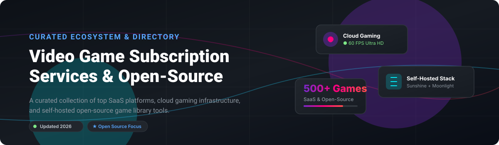

  

# 🎮 Awesome Video Game Subscription Services & Open-Source Ecosystem 🚀

  
  
  
  

> **A curated, SEO-optimized list of top commercial SaaS platforms, cloud gaming services, self-hosted streaming infrastructure, and open-source game library managers.**

---

## 💡 Overview & Market Insights 📈

> [!NOTE]
> **Market Size & Structure**: The global **Video Game Subscription & Cloud Gaming market** is estimated at **$15.2 Billion (2026)** and projected to reach **$30+ Billion by 2030**.
> The market is **moderately fragmented** between commercial category leaders (Microsoft Xbox Game Pass, Sony PlayStation Plus, NVIDIA GeForce NOW) controlling primary game licensing, and a rapidly expanding **open-source ecosystem** (Sunshine, Moonlight, Heroic, Playnite) delivering decentralized cloud gaming infrastructure and unified game launchers.

---

## 🏢 Commercial SaaS & Cloud Gaming Platforms 🌐

Below is a comparison of major commercial video game subscription and cloud gaming services, sorted by estimated parent company valuation/market cap in descending order.

| 🏢 Platform | 💰 Company Valuation / Market Cap | 🏷️ Starting Price | 🎁 Free Tier / Trial Limit | 🎮 Core Features & Highlights |
| :--- | :--- | :--- | :--- | :--- |
| **[Microsoft Xbox Game Pass Ultimate](https://www.xbox.com/game-pass)** | ~$3.1 Trillion *(Microsoft)* | $19.99 / month | 14-Day Trial for $1 (Select regions/promos) | 400+ games, Day-one releases, Xbox Cloud Gaming (xCloud), EA Play & Ubisoft+ Classics inclusion. |
| **[Apple Arcade](https://www.apple.com/apple-arcade/)** | ~$3.0 Trillion *(Apple)* | $6.99 / month | 1-Month Free Trial (3 months with new Apple device) | 200+ premium mobile/Mac games with zero ads or in-app purchases. |
| **[Google Play Pass](https://play.google.com/store/pass/get)** | ~$2.1 Trillion *(Alphabet)* | $4.99 / month ($29.99/yr) | 1-Month Free Trial | 1,000+ premium Android games & apps without ads or microtransactions. |
| **[Amazon Luna+](https://www.amazon.com/luna/)** | ~$1.9 Trillion *(Amazon)* | $9.99 / month | Prime Gaming Free Tier (Includes rotating GOG/Luna games for Amazon Prime members) | Cloud gaming channels, GOG library stream integration, Fire TV & browser support. |
| **[GeForce NOW](https://www.nvidia.com/geforce-now/)** | ~$3.2 Trillion *(NVIDIA)* | $9.99 / month (Performance Tier) | **Free Forever Plan** (1-hour session limit, basic rig access, standard queues) | Streams owned games from Steam, Epic, & GOG; up to 4K 120FPS on Ultimate tier. |
| **[Sony PlayStation Plus Premium](https://www.playstation.com/ps-plus/)** | ~$115 Billion *(Sony)* | $17.99 / month ($159.99/yr) | 7-Day Free Trial (Available during promotional periods) | PS5/PS4/PS3 Cloud Streaming, Game Catalog (400+ games), Classics Vault, Game Trials. |
| **[Nintendo Switch Online](https://www.nintendo.com/switch/online/)** | ~$62 Billion *(Nintendo)* | $3.99 / month ($19.99/yr) | 7-Day Free Trial | Online multiplayer, NES/SNES/Game Boy retro library, cloud saves. (+ Expansion Pack $49.99/yr for N64/GBA/Genesis). |
| **[EA Play](https://www.ea.com/ea-play)** | ~$38 Billion *(Electronic Arts)* | $5.99 / month ($39.99/yr) | 10-Hour Free Trial for major new EA releases | EA back-catalog access, 10% discount on EA digital purchases, member rewards. |
| **[Ubisoft+](https://www.ubisoft.com/ubisoftplus)** | ~$3.5 Billion *(Ubisoft)* | $17.99 / month (Premium Tier) | 7-Day Free Trial (Occasional promotional campaigns) | 100+ PC games, Day-one premium editions, expansion passes, cloud streaming integration. |
| **[Antstream Arcade](https://www.antstream.com/)** | Privately Held (~$25M) | $4.99 / month ($39.99/yr) | **Free Forever Tier** (Ad-supported with in-game gem currency & session limits) | 1,300+ retro arcade games, global leaderboards, mini-game challenges. |

---

## 🔓 Open-Source GitHub Projects & Self-Hosted Infrastructure ⚡

Below is the curated list of top open-source projects for self-hosted cloud gaming, game streaming servers, and cross-platform unified launchers. Sorted by **GitHub_Stars_Count** (descending).

| 📦 Project | ⭐ GitHub_Stars | 🛠️ Tech Stack & Purpose | 📌 Description |
| :--- | :--- | :--- | :--- |
| **[Sunshine](https://github.com/LizardByte/Sunshine)** |  | C++, WebRTC, NVENC/VAAPI | **Self-hosted low-latency game streaming server** for Moonlight. Open-source alternative to NVIDIA GameStream. |
| **[Moonlight PC](https://github.com/moonlight-stream/moonlight-qt)** |  | C++, Qt, OpenGLES | **GameStream/Sunshine client for PC & Mac**. Stream games from your cloud/desktop server at up to 4K 120 FPS. |
| **[Playnite](https://github.com/JosefNemec/Playnite)** |  | C#, .NET, WPF | **Open-source video game library manager** for Windows. Unifies Steam, Epic, GOG, Battle.net, and emulators. |
| **[Heroic Games Launcher](https://github.com/Heroic-Games-Launcher/HeroicGamesLauncher)** |  | TypeScript, Electron, React | **Cross-platform launcher for Epic, GOG, and Amazon Games** on Linux, macOS, and Windows (Steam Deck optimized). |
| **[Lutris](https://github.com/lutris/lutris)** |  | Python, GTK3, Wine | **Open-source gaming platform for Linux**. Preserves games across Steam, GOG, Windows titles via Wine, and emulators. |
| **[Legendary](https://github.com/derrod/legendary)** |  | Python, CLI | **CLI open-source replacement for Epic Games Launcher**. Lightweight tool to download and launch Epic games. |
| **[Cloudy Pad](https://github.com/PierreBeucher/cloudypad)** |  | Go, Terraform, AWS/GCP | **Self-hosted cloud gaming platform on cloud spot instances**. Open-source alternative to GeForce NOW (~$15/mo pay-as-you-go). |
| **[Cartridges](https://github.com/kra-mo/cartridges)** |  | Python, GTK4, Libadwaita | **GTK4 Libadwaita game launcher for GNOME/Linux**. Automatically imports games from Steam, Heroic, RetroArch & Flatpak. |
| **[Lazap](https://github.com/LegItMate/Lazap)** |  | C++, SDL2, GPU UI | **Lightweight, offline-capable unified game launcher** for Steam, Epic, Ubisoft, and Rockstar libraries. |
| **[CloudMorph](https://github.com/giongto35/cloud-morph)** |  | Go, WebRTC, Wine | **Decentralized, browser-based cloud gaming service**. Streams Windows applications directly to web browsers via WebRTC. |

---

## 🛠️ How to Contribute 🤝

1. Fork this repository.
2. Edit `README.md` to add or update entry details.
3. Submit a Pull Request with a brief summary of additions.

See [Awesome-Awesome-Awesome](https://github.com/ishandutta2007/Awesome-Awesome-Awesome) for more awesome lists.

---

## 💖 Support & Sponsorship ☕

Thank you for exploring and using this repository! If you find this curated ecosystem list helpful, please consider supporting the project:

- ⭐ **Star** this repository on GitHub to help others discover it.
- 🔀 **Fork** and contribute open-source tools or SaaS updates.
- 📢 **Share** with fellow gamers, self-hosters, and cloud gaming enthusiasts!
- ☕ **Sponsor / Buy me a coffee**: Check out the [GitHub Sponsor Dashboard](https://github.com/sponsors/ishandutta2007) to support ongoing open-source maintenance.

---

## ⭐ Star History

---

## 📜 Disclaimer ⚖️

This is a community-curated list and is not affiliated with or endorsed by Microsoft, Sony, NVIDIA, Apple, or Google. Trademarks belong to their respective owners.
